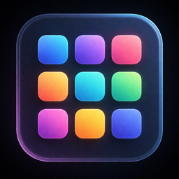

  

<h1 align="center">LaunchOrigo</h1>

  A faster, more customizable Launchpad replacement for macOS.

  &nbsp;
  &nbsp;
  

---

## About

LaunchOrigo replaces the macOS Launchpad with a faster, more customizable grid that stays out of your way until you need it. Press a global hotkey, find your app, launch it.

## Features

- **Global hotkey** — open the overlay from anywhere
- **Keyboard-first** — arrow keys, type-to-search, return to launch
- **Drag-and-drop organization** — reorder apps and group them into folders
- **Customizable interface** — background styles, grid size, page mode
- **Auto-updates** — built-in via Sparkle, signed and notarized
- **Export / import** — back up your full layout to a JSON file

## System Requirements

- macOS 26.0 or later
- Apple Silicon or Intel Mac

## Installation

1. Download `LaunchOrigo-x.x.x.zip` from the [latest release](../../releases/latest)
2. Unzip and move `LaunchOrigo.app` to your Applications folder
3. Launch the app

On first open, macOS may show a Gatekeeper dialog. Click **Open** — the app is signed with a Developer ID certificate and notarized by Apple.

## Auto-Updates

LaunchOrigo checks for updates automatically once per day via [Sparkle](https://sparkle-project.org/). You can also check manually:

- Settings → About → Check for Updates
- Menu bar → Check for Updates

## Security

- Signed with **Apple Developer ID Application** certificate
- **Notarized** by Apple for macOS Gatekeeper
- Sparkle updates verified with an EdDSA public key
- No tracking or analytics

---

*This repository contains only release artifacts. The source code is private.*
